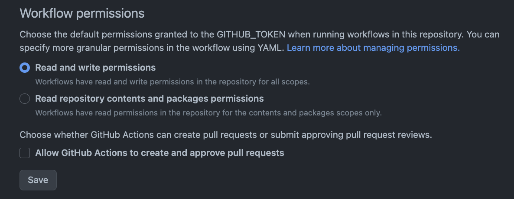

# marp-auto-build

marpで作成したスライドを自動でビルドし、GitHub Pagesにデプロイします。

- 公開先：https://kentakom1213.github.io/marp-auto-build/

## 手順

### 1. gitのhookを設定

`.git/hooks/pre-commit`を作成し、以下を書き加えます。

```sh
#!/bin/zsh

# arrange files
./organize-md.sh

# staging
git add .
```

**注意**：`organize-md.sh`はzshで書かれているため、それ以外のシェルを使っているかたは適宜書き換えてください。


### 2. 権限の追加

リポジトリの設定画面から、

`Settings > Actions > General > Workflow permissions` を `Read and write permissions` に変更します。




### 3. GitHub Pagesを有効化

リポジトリの設定画面から、

`Settings > Pages > Build and deployment > Branch`を`gh-pages`に変更してください。


### 4. スライドの追加

スライドは、`example/`ディレクトリにならって作成してください。

```
${スライド名}/
  ├ images/
  │  ├ image1.png
  │  ├ image2.png
  │  ...
  └ slide.md
```

**注意**：`images/`の中に入っているファイル名が重複すると、`slides/images`に画像がコピーされる際に上書きされてしまうため、全スライドを通じてファイル名は重複しないようにしてください。

自作css等のカスタムテーマは、`.marp/themes`ディレクトリに格納してください。


### 5. commit & push

mainブランチにコミットし、pushされるとGitHub Actionsにより自動でビルド、デプロイされます。
デプロイ先のURLは`https://${GitHubのユーザ名}.github.io/${リポジトリ名}`です。

# 参考

- [Marpでスライドを作成しよう 〜 カスタムテーマとGitHub Actionsによる自動化まで 〜](https://zenn.dev/istyle/articles/8f13b876af7e3b)
